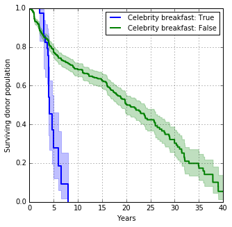
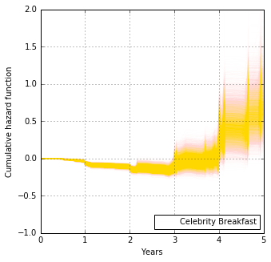

# Donor lifetimes and values for a non-profit

Overview
========
Background
----------

- Only 20% of revenue of an average non-profit comes from donations (most of the rest of government contacts)
- There is often no-coherent strategy for recruiting or retaining donors.  Traditional methods range from holding expensive special events to personal connections.  Often this is done by hunches and without any analytical support.
- Questions to be answered:
	1.  What are the good predictors of donor lifetimes?  More importantly, how do these predictors influence them.
	2.  How to extend donor lifetimes?
	3.	What are the features of a good or bad donor?  (Determined by calculating the Donor lifetime values)

Data
----
- Donor database from South Bay non-profit.
- 1328 donors spanning over 40 years.
- Each row contains >100 features.  Example of features: ZIP code, martial status, gender...

Modeling
========
Approach
--------
- The Aalen Additive model, which is patient-survival model, was used to predict the lifetime. The model fits the data to a *hazard function* in turn is used to predict the lifetime.

- The hazard function is composed of features (known as *hazards*) which can influence the lifetime of each donor in our use case.

	λ(t) = b0(t) + b1(t)x1 +. . . +bN(t)xT,  where b0(t) is the baseline hazard function and xn are the hazards and bn are the parameters.

- To train the model, we only use the donors who have churned (defined as not donated in the last two years).  In the survival-model parlance, the donors who have not churned are "censored," so they are removed from the training.  This is done because we do not know the lifetimes of these donors yet.   After the model is trained, we will use it to predict the lifetimes of the "censored" donors.

- FAQ
	1.	Why not a multi-decision tree model?  Because a patient-survival model is more interpretable.
	2.	Why not linear or logistic regression?  Because the residuals are not uniform over time.  This is turn to due to the fact that the number of donors decreases as more of them churn over time.
	3.  Why not a proportional hazard model, such as the Cox proportional hazard model?  Because this assumes the hazards are in at a fixed proportion with each other over time.  There is no reason to believe that is true in our case.

Data processing
---------------
- Python pandas was used to impute and clean up data.
- A column of '1' is added to the data as the baseline.  This is the represent all other hazards that are not explained by the included features.
- Data package [ "Lifelines" ](http://lifelines.readthedocs.org/en/latest/) which contains the Aalen additive model was used to model and plot the data.

- The more than 100 features were whittled down to 7 by *backward stepwise selection.*  These 7 featuers are as follows.
	1.	ACGC (whether a donor comes from the ACGC branch of the organization).  This is a another non-profit that was merged into the organization in 1995.
	2.	Celebrity breakfast (An annual $100/plate breakfast event with a celebrity speaker)
	3.	Golf tournament (An annual golf tournament held at a country club that cost $1000 to play)
	4.	Male (True = male, False = female)
	5.	Married (True = married or partnered, False = single, divorced, or widowed)
	6. 	Personal connection (True =  a personal friend or acquaintance of an employee of the agency.)
	7.  Predicted income (Using the zip code, we scrapped the US Census Bureau website for the average household income and use this as the feature.)

- The Keplan-Meier function (or estimator) was used initially to provide quick inspection of the data.  It represents the percent of the donors who have "survived" after a certain time.  Typical it is plotted to illustrate a data set that is stratified against a certain feature, such "married" or not "married."  It allows us to spot initial trends of the data set.   Details of the Kaplan-Meier function can be found [here](https://en.wikipedia.org/wiki/Kaplan–Meier_estimator).
  Some initial observations.  Note that the error (shaded area = one standard deviation) increases with time.  This reflects the decrease in the sample size as time progresses (donors churn), and is the reason why a simple regression model is not appropriate (See "why not linear or logistic regression?" above.)  Because of this, the rest of the study will focus on the donor survival during for first 5 years.
	1. High cost events such as the Golf Tournaments and the Celebrity Breakfasts lead to very short lifetimes compared to the overall population.  However, the Celebrity-Breakfast donors tend to have a higher survival rate for the first 3 years.
	2. Male donors have longer lifetimes than Female donors do.
	3. Unmarried donors tend to churn more than married donors during the first 20 years, but the trend is reversed after 20 years.
	4. Surprisingly, having a personal connection with the donor shortens the lifetime.
	5. Not Surprisingly, donors with below average income (compared to other donors, not to the general population) tend to churn faster than donors with above average income.

Bootstrapping
-------------
- Because of the relative small data set, a bootstrap approach was used to model the data.   Samples were drawn with replacement from the original data set 10 000 times to train 10 000 models.  These 10 000 models generated 10 000 hazard functions.  

- The 10 000 trained bootstrapped models took over 12 hours to be trained.  To save time, they are stored in the list which is then pickled.  However, because of the size limit of github, I only loaded a shortened version of a file with 100 bootstraps (AAF_list_100.p).  All results from this page are from the 10 000 bootstrapped models.

Results
=======
1. Hazards
----------
The plots below show the hazard functions generated by the bootstrapped models.  The spread of the lines are caused by the variance of the results among the 10 000 models.   
-  The baseline hazard function represents all the hazards not accounted for by the hazards.  That is, it is the hazard function if all the categorical features were false and all the numerical features were at their average values.  

- The hazard function for each hazard is plotted below, each showing at what time in a donor's lifetime the specific hazard will emerge. Note that even though these functions are called "hazards," when they are negative, they are actually "benefits" that prolong the lifetime of the donor.  For example, a higher than average income would produce a negative hazard over much of the lifetime of a donor.

2.	Predicting Hazards for individual donors
--------------------------------------------

- In addition to predicting a donor's lifetime, the hazard function allows us to customize a hazard function that  predicts at what times in her or his lifetime hazards will emerge (represented by steep slopes in the hazard function).  This is illustrated below by the plots of the hazard function 4 random donors, represented by green, blue, red, and purple curves.  Each color is the composite of  the 10  000 bootstrapped models.  The spread of each function is caused by the difference among the 10 000 bootstrapped models and represents the variance between them. As can be seen, each donor has a different hazard profile.  For example, the green donor was recruited from a golf tournament which leads to a high hazard at 2nd year of his lifetime.  

3.	Donor lifetime values
---------------------
- One important question that needs to be answered and what the donor lifetime values (DLV) are for donors with different characteristics.   We focus on three features: Golf, Celebrity breakfast, and Married.  We compare the DLV for those whose feature is True and False.  

	DLV = *Donor Lifetime* x (*annual donationavg* - *annual recruitment and maintenance costs*)

*Recruitment/maintenance costs* are the sum of the following.

1.	One-time cost of recruitment (e.g., the cost of the golf event amortized for each successful donor recruited at the event)
2.	Recurring costs (e.g., periodic mailers, maintenance of donor database)

The results are plotted in the figures below.

**Conclusions**
===============
1.	Donors recruited at *golf tournaments* have negative DLV of about -$1000.  This is not surprising because it cost $50 000 to hold each golf tounatment and the hazard function for golf is extremely high even after two years.

2.	Donors who are recruited at the *Celebrity breakfast* have higher DLV than those who are not (the rest), even though each event costs $30 000 to hold.   This is because each event generated more donors and they each donate more money than the golf tournaments.

3.  Unmarried donors have higher DLV than married donors, even though the hazard function for married is negative (indicating being married is beneficial).  This is also because unmarried donors tend to donor more than married donors.
